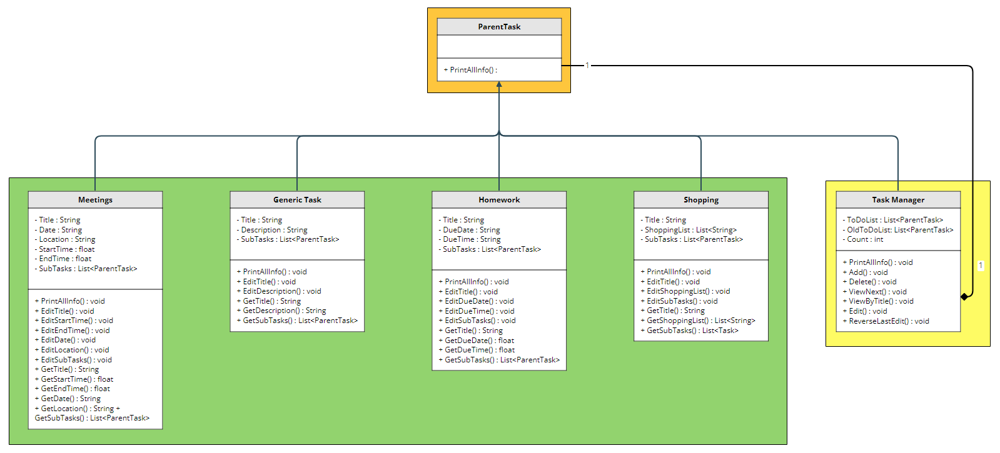

 # Task Manager
 Authors: [Siddharta Dutta](https://github.com/SiddhartaDutta), [Sarah Kim](https://github.com/sarahkimmieee), [Jacob Do](https://github.com/jacobcdo), [Shihwei Lin](https://github.com/slin182)

## Project Description
  
For our project, we wanted to create something that would not only help us personally, but people in general. We decided, given we are college students ourselves, we would create a task schedule tracker to help us and other college students stay organized. To accomplish this, we plan on using C++ to create our scheduler and plan on using different data structures such as queues and lists to organize entries.

Some features this task manager will include: Tasks (with a title, description, tag/classification, duration, due data), time conflict checker when adding tasks, subtasks.
Users will be able to add, delete, view, and edit tasks/subtasks. These edits, regardless of scale (simple edit to task deletion), will also be reversible once per edit.

The program will be interacted through a CLI.

## Class Diagram
 Link to class diagram [here](https://app.moqups.com/HLxRWlfaIpcROvGcueaSVdEqONtGUJtv/view/page/aa458c046). 

 

 
 > ## Final deliverable
 > All group members will give a demo to the TA/reader during lab time. The TA/reader will check the demo and the project GitHub repository and ask a few questions to all the team members. 
 > Before the demo, you should do the following:
 > * Complete the sections below (i.e. Screenshots, Installation/Usage, Testing)
 > * Plan one more sprint (that you will not necessarily complete before the end of the quarter). Your In-progress and In-testing columns should be empty (you are not doing more work currently) but your TODO column should have a full sprint plan in it as you have done before. This should include any known bugs (there should be some) or new features you would like to add. These should appear as issues/cards on your Project board.
 > * Make sure your README file and Project board are up-to-date reflecting the current status of your project (e.g. any changes that you have made during the project such as changes to your class diagram). Previous versions should still be visible through your commit history. 
 
 ## Screenshots
 > Screenshots of the input/output after running your application
 ## Installation/Usage
 > Instructions on installing and running your application
 ## Testing
 > How was your project tested/validated? If you used CI, you should have a "build passing" badge in this README.
 
