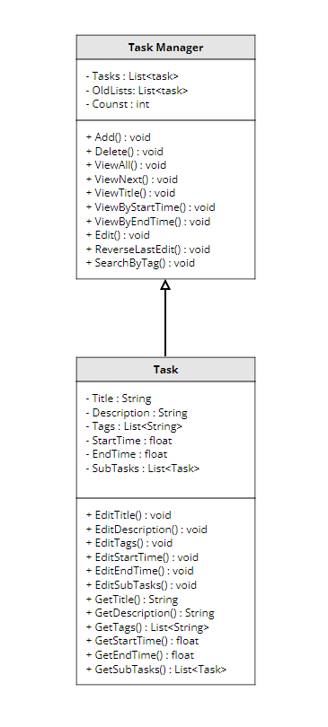

 # Task Manager
 Authors: [Siddharta Dutta](https://github.com/SiddhartaDutta), [Sarah Kim](https://github.com/sarahkimmieee), [Jacob Do](https://github.com/jacobcdo), [Shihwei Lin](https://github.com/slin182)

## Project Description
  
For our project, we wanted to create something that would not only help us personally, but people in general. We decided, given we are college students ourselves, we would create a task schedule tracker to help us and other college students stay organized. To accomplish this, we plan on using C++ to create our scheduler and plan on using different data structures such as queues and lists to organize entries.

Some features this task manager will include: Tasks (with a title, description, tag/classification, duration, due data), time conflict checker when adding tasks, subtasks.
Users will be able to add, delete, view, and edit tasks/subtasks. These edits, regardless of scale (simple edit to task deletion), will also be reversible once per edit.

The program will be interacted through a CLI.

## Class Diagram
 Link to class diagram [here](https://app.moqups.com/HLxRWlfaIpcROvGcueaSVdEqONtGUJtv/view/page/aa458c046). 

 

 For our program to work, we need 2 classes. The first class is called "TaskManager." This class has 3 private member variables, Tasks, OldLists, and Count. Tasks is a List of Task type that will hold all of the tasks to be recorded for the day. OldLists will always be updated to be a pervious version of Tasks prior to every Tasks update to allow users to revert changes once. Count holds the amount of primary tasks the list contains should the user want to know how many primary tasks remain. The public member functions allow the user to interact with this class to be able to create their own schedule:

Add() allows the user to add tasks to the list of tasks. Delete() allows the user to delete a specified task. ViewAll() allows the user to view all scheduled tasks.
ViewNext() allows the user to view the next scheduled task.
ViewTitle() allows the user to search and view by a specified title.
ViewByStartTime() allows the user to search and view tasks at a specified start time.
ViewByEndTime() allows the user to search and view tasks at a specified end time.
Edit() allows the user to edit a specified task.
ViewByTag() allows the user to search and view tasks by a specified tag.
ReverseLastEdit() allows the user to revert back one edit.

The second class is the "Task" class and are the details of each task stored in "TaskManager." It has private member variables that include a title, description, tags, start time, end time, and subtasks. Each is self-explanatory save subtasks which is a list of tasks should the task have subtasks.

The following are the public member functions of the class:

EditTitle() allows the user to edit the title of the task. 
EditDescription() allows the user to edit the description of the task.
EditTags() allows the user to edit the tags of the task.
EditStartTime() allows the user to edit the start time of the task.
EditEndTime() allows the user to edit the end time of the task.
EditSubTasks() allows the user to edit sub tasks.
GetTitle() returns the title of the task.
GetDescription() returns the description of the task.
GetTags() returns the tags of the task.
GetStartTime() returns the start time of the task.
GetEndTime() returns the end time of the task.
GetSubTasks() returns the sub tasks of the task.
 
The design patterns we chose are the factory method and the strategy pattern. We chose the factory method because of the ease with which it would allow client-side updates. With the factory method, we can update our "library classes" (the parent class and task type subclasses) as we see fit at any given point in time. Since we do not want the client to have to learn a new way to create tasks. By separating the creation of the task object from the client class we can create updates for the parent and subclasses while allowing for the client class to no longer require recompilation. Recompilation will only be required for the library classes and the factory method. We also decided to use the strategy patten because it would allow us to use different algorithms for each task subclass type. This would allow us to organize our code much more neatly into strategies of operations. This way, 

The design patterns we chose include the following:

 
 > ## Final deliverable
 > All group members will give a demo to the TA/reader during lab time. The TA/reader will check the demo and the project GitHub repository and ask a few questions to all the team members. 
 > Before the demo, you should do the following:
 > * Complete the sections below (i.e. Screenshots, Installation/Usage, Testing)
 > * Plan one more sprint (that you will not necessarily complete before the end of the quarter). Your In-progress and In-testing columns should be empty (you are not doing more work currently) but your TODO column should have a full sprint plan in it as you have done before. This should include any known bugs (there should be some) or new features you would like to add. These should appear as issues/cards on your Project board.
 > * Make sure your README file and Project board are up-to-date reflecting the current status of your project (e.g. any changes that you have made during the project such as changes to your class diagram). Previous versions should still be visible through your commit history. 
 
 ## Screenshots
 > Screenshots of the input/output after running your application
 ## Installation/Usage
 > Instructions on installing and running your application
 ## Testing
 > How was your project tested/validated? If you used CI, you should have a "build passing" badge in this README.
 
