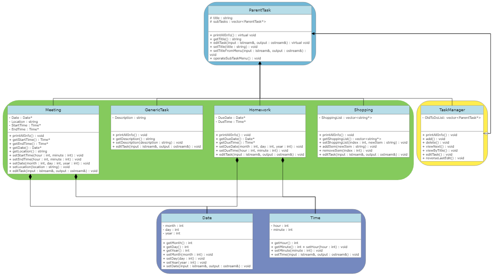

 # Task Manager
 Authors: [Siddharta Dutta](https://github.com/SiddhartaDutta), [Sarah Kim](https://github.com/sarahkimmieee), [Jacob Do](https://github.com/jacobcdo), [Shihwei Lin](https://github.com/slin182)

## Project Description
  
For our project, we wanted to create something that would not only help us personally, but people in general. We decided, given we are college students ourselves, we would create a task schedule tracker to help us and other college students stay organized. To accomplish this, we plan on using C++ to create our scheduler and plan on using different data structures such as queues and lists to organize entries.

Some features this task manager will include: Tasks (with a title, description, tag/classification, duration, due data), time conflict checker when adding tasks, subtasks.
Users will be able to add, delete, view, and edit tasks/subtasks. These edits, regardless of scale (simple edit to task deletion), will also be reversible once per edit.

The program will be interacted through a CLI.

## Class Diagram

### Strategy Patterns Implemented

The design patterns we chose include the following:

- Strategy: We chose to use strategy to allow us to create and add new types of tasks easily that all share common algorithms with differing implementations. By following the strategy pattern, we can quickly and easily add additional task subtypes and the respective algorithms required. It also allows the user to have a consistent syntax when dealing with multiple types of subtasks. This helps us write better code as we do not have to update client-side code every time a new subclass is created and thus enables us to better organize the code. It also allows us to quickly add new subtasks relatively quickly and smoothly. In the above diagram, the strategy pattern can be comprised by the blue, green, and yellow regions which show an abstract class *ParentTask* that has virtual functions implemented uniquly in the different subclasses. This allows for the composite subclass to use the same calls for the different objects while producing different results (due to the differing implementations of each respective algorithm).

- Composite: We used the composite strategy to a small degree to allows us to quickly create multiple different task subtypes that will all also be grouped together and interfaced by a single client class. By having the project set up in this format, we can not only easily integrate new task subtypes because of their shared ParentTask class allowing for consistent operation syntax, but the use of a strategy pattern compliments this fast development and integration promoting design. In the above diagram, the composite pattern can be comprised of the blue, green, and yellow regions which show the component class *ParentTask*, the composite class *TaskManager*, and the different leaves: *Meeting*, *GenericTask*, *Homework*, *Shopping*.

### Class Descriptions
For this project, there are a total of <u>eight</u> different classes required. The classes, as depicted in the diagram, are divided into <u>four</u> different categories. The four categories are:

- Blue: The single blue class, *ParentTask*, acts as both an abstract class for the implemented strategy pattern and as the component class for the implemented composite pattern. It contains the member variables `title` and `subTasks` which represent the title of a task and the subtasks that can make up a given task, respectively. As these are shared by all subclasses, they can be protected variables of the abstract class. The pure virtual methods of the class are editTask and printAllInfo as each subclass has it's own unique member variables so editing and printing all of its data requires different algorithms.

- Yellow: The single yellow class, *TaskManager*, acts as a composite for the component pattern as well as the class through which the client interfaces (client being main). It contains a single member variable, `OldToDoList` which is a vector that is updated before each update to the *ParentTask* vector so that any changes can be reverted once by the user.

- Purple: The *Date* and *Time* classes are not subclasses of *ParentTask*. Rather, they are "helper" classes so that dates and times can be uniformly represented and interacted with. It also makes the code neater in general since there aren't a multitude of date and time related variables with long names to clearly differentiate them. The *Date* class has the three member variables `month`, `day`, and `year` (all `int` type) that are accessed and modified by their "bare" accessors and mutators as well as by an all-encompassing mutator that uses a menu to allow the user an interactive way to edit the object. The *Time* class works in the same manner but with the `hour` and `minute` member variables (also both are `int` type).

- Green: The green category includes the *Meeting*, *GenericTask*, *Homework*, and *Shopping* subclasses. These classes inherit from *ParentClass* and act both as leaves for the composite pattern and as different concrete strategies for the strategy/compositor (the *ParentTask* class). These help to divide the different subtasks with their different parameters into different children classes with common algorithm calls so that they can be treated in a uniform manner. Each subclass contains accessors and mutators for their member variables while also containing an extra "menu-nized" mutator like that found in the `Date` and `Time` classes described above. 

- PrintAllInfo() : Prints all member variable data
- EditTitle() : Edits title of task
- EditStartTime() : Edits start time of task
- EditEndTime() : Edits end time of task
- EditDate() : Edits date of task
- EditLocation() : Edits location of task
- EditSubTasks() : Edits subtasks
- EditDescription() : Edits description of task
- EditDueDate() : Edits task due date
- EditDueTime() : Edits task due time
- EditShoppingList() : Edits string list
- GetTitle() : Returns task title
- GetStartTime() : Returns task start time
- GetEndTime() : Returns task end time
- GetDate() : Returns task date
- GetLocation() : Returns task location
- GetSubTasks() : Returns subtask list
- GetDescription() : Returns task description
- GetDueDate() : Returns task due date
- GetDueTime() : Returns task due time
- GetShoppingList() : Returns task string list

The following describes all the core methods of the client class:

- PrintAllInfo() : Prints all member variable data
- Add() : Add task
- Delete() : Delete task
- ViewNext() : View next task
- ViewByTitle() : Search tasks by title
- Edit() : Edit task
- ReverseLastEdit() : Reverse last edit 
 
 ## Screenshots
 Currently unavailable since project still in development.

 ## Installation/Usage
 Since the project is still in development, installation is not currently an option. However, you can download the "test.exe" file which will run all current tests from here: [Google Drive to "test.exe"](https://drive.google.com/drive/folders/1P3eTyWPxXYc-eMa-bkTmEFtWDHt6gyM6?usp=sharing)
 
 ## Testing
 To test the project, we utilized the googletest testing framework. After setting up the appropriate files, we followed the following system to ensure the project was consistently validated:
 1. Develop code to solve current issue being solved.
 2. After development phase, begin rigorous testing of new code developed (test as many different/possible scenarios).
 3. After all tests are confirmed to be passing, assign separate members to review and merge the development and testing branch (branch being worked on).
 4. After the branch is verified, it can be merged.

 Following this simple system, we were able to ensure code additions did not cause other parts of the project previously working to have errors or "break." Running compiling the project using the "Installation/Usage" instructions and running the "test.exe" file will run all currently implemented tests.